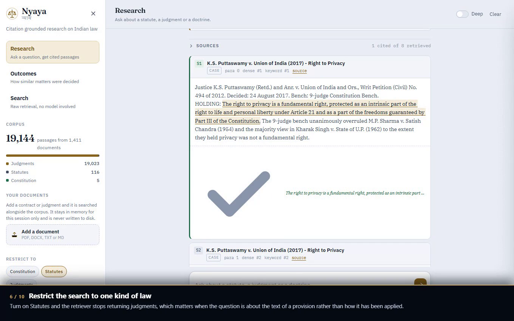

# Nyaya

Citation grounded research over a corpus of Indian statutes and judgments.

Ask a question and Nyaya searches 19,144 passages drawn from 1,411 documents,
answers only from what it found, and tags every claim with the paragraph behind
it. Each tag is checked against the passage it names before the answer is
rendered, so a citation the model invented shows up as unverified in the
interface rather than passing as fact. When the corpus does not hold the answer,
the app says so instead of filling the gap from memory.

Built for the ILTN Vibeathon.

---

## Demo

A full walkthrough of every feature, captioned. Nothing is mocked: every answer
on screen came back from a live model during the recording.

[](docs/demo/legal-rag-nyaya.mp4)

**[Watch the walkthrough, 5m 28s](docs/demo/legal-rag-nyaya.mp4)** &nbsp;·&nbsp;
[Captions (.srt)](docs/demo/legal-rag-nyaya.srt)

> GitHub opens the file in its own video player. To download it instead, use
> the **Raw** button on that page.

---

## Two branches

| Branch | What is on it |
| --- | --- |
| **`main`** | This version. FastAPI, a no build front end, bring your own key, deployable free on Render. |
| **`streamlit`** | The original Streamlit application, preserved unchanged at commit [`ccbdcd7f`](../../tree/streamlit). |

The Streamlit version still runs. It was rebuilt rather than patched because
Streamlit re-runs the whole script on every interaction, which fights against a
multi step legal workflow, and because a Streamlit deployment cannot accept a
visitor's own API key per request.

---

## What it does

**Research.** A question goes through a router that rewrites it for retrieval,
then hybrid search over dense vectors and BM25, then synthesis constrained to
the retrieved passages. Every `[S#]` tag in the answer is clickable and scrolls
to the exact paragraph, with the quoted span highlighted inside it.

**Outcomes.** Describe a matter and Nyaya finds the closest cases in a labelled
corpus of Indian decisions, reports how each was actually decided, and explains
what separates the two groups. It reports a pattern in past cases. It does not
predict a result, and the interface says so on every report.

**Your own documents.** Upload a contract, a notice or a judgment. It is chunked
and embedded in memory for your session, then searched alongside the corpus, so
an answer can cite your clause and a statute in the same breath. Nothing is
written to disk.

**Search.** Raw retrieval with no model in the loop, showing the dense and
keyword rank of every hit. Free, needs no key, and answers in about 20 ms.

---

## Works with whatever key you have

Five providers are supported: **Groq, Google Gemini, Cloudflare Workers AI,
OpenAI and Hugging Face**. Retrieval never needs any of them, because the
embedder runs locally; a key is only needed to have a model write prose over
the retrieved passages.

**Cloudflare needs two values, not one.** Its account id is part of the request
URL rather than a header, so `CLOUDFLARE_API_TOKEN` and
`CLOUDFLARE_ACCOUNT_ID` are both required and the provider is skipped entirely
when only one is set. A visitor pasting a `cfut_` token is shown a second field
for the account id, which travels in `X-Provider-Account` and is validated as
letters and digits only before it reaches the URL. Its default models are
`@cf/meta/llama-3.3-70b-instruct-fp8-fast` for fast and
`@cf/openai/gpt-oss-120b` for deep.

**One default changed:** the Gemini deep model was `gemini-2.5-pro`, which now
returns 404 on a free AI Studio key and made the Deep toggle fail outright. It
now defaults to `gemini-2.5-flash`, and `GEMINI_DEEP_MODEL` still overrides it.

Groq, Gemini, OpenAI and Hugging Face are all reached through one OpenAI
compatible client. Configure any one of them and the app works. Configure
several and they become a fallback chain: if the first is rate limited or out of
credit, the next one answers, and the interface reports which provider actually
served the request.

**With no key at all the app still works.** Embeddings run locally on CPU
through an ONNX build of MiniLM, so retrieval never depends on an API. With
nothing configured you get ranked, cited passages and no written prose, and the
app says plainly that it is in retrieval only mode. Visitors can also paste
their own key into the settings panel; it is held in their browser, sent with
their requests, and never stored on the server.

| Provider | Fast model | Deep model | Get a key |
|---|---|---|---|
| Groq | `openai/gpt-oss-20b` | `openai/gpt-oss-120b` | [console.groq.com/keys](https://console.groq.com/keys) |
| Gemini | `gemini-2.5-flash` | `gemini-2.5-pro` | [aistudio.google.com/apikey](https://aistudio.google.com/apikey) |
| OpenAI | `gpt-4o-mini` | `gpt-4o` | [platform.openai.com/api-keys](https://platform.openai.com/api-keys) |
| Hugging Face | `Llama-3.3-70B-Instruct` | `Qwen2.5-72B-Instruct` | [huggingface.co/settings/tokens](https://huggingface.co/settings/tokens) |

Every model name is overridable through an environment variable, so a provider
retiring a model is a dashboard edit rather than a code change.

---

## Deploy to Render

1. Push this folder to a GitHub repository. The prebuilt index in `data/index`
   is committed on purpose, about 80 MB across four files, each one under
   GitHub's 100 MB limit.
2. In Render, choose **New** then **Blueprint**, and point it at the repository.
   `render.yaml` describes the service, so nothing needs configuring by hand.
3. Under **Environment**, add whichever provider keys you have. All are
   optional. If you add none, the service still deploys and serves retrieval.
4. Deploy. The first build takes six to eight minutes, mostly downloading the
   embedding model into the image so that cold starts do not pay for it later.

Health checks hit `/api/health`. The free plan sleeps after fifteen minutes of
inactivity, so the first request after a nap takes about thirty seconds while
the container wakes. Judges hitting a cold link is the one rough edge of the
free tier; a paid instance removes it.

### Why it fits in 512 MB

The original prototype carried a 516 MB ChromaDB directory, which does not fit
on Render's free plan at all. This version replaces it with three artifacts:

| File | Size | How it is used |
|---|---|---|
| `vectors.npy` | 29 MB | memory mapped, so the OS pages it rather than the process holding it |
| `chunks.sqlite` | 40 MB | read only, queried for the handful of rows in a result set |
| `bm25.npz` | 10 MB | BM25 weights precomputed as a sparse matrix |

A keyword query becomes one sparse column slice and a row sum instead of a scan,
which is why search returns in about 20 ms. The embedding model is ONNX rather
than PyTorch, which keeps roughly 800 MB of CUDA and torch wheels out of the
image.

---

## Run it locally

```bash
cd legal-rag-hoster
python -m venv .venv && .venv/Scripts/activate      # Windows
# python3 -m venv .venv && source .venv/bin/activate  # macOS or Linux

pip install -r requirements.txt
cp .env.example .env                                 # add a key, or do not
uvicorn app.main:app --reload --port 8000
```

Open <http://127.0.0.1:8000>. The first question is slower while the embedding
model loads, after which queries are fast.

With Docker:

```bash
docker build -t nyaya .
docker run -p 8000:8000 -e GROQ_API_KEY=gsk_... nyaya
```

### Verify it

```bash
python scripts/smoke_test.py --base http://127.0.0.1:8000
```

Thirty eight checks covering health, retrieval quality, citation verification,
uploads, outcome analysis, input validation and static assets.

### Rebuild the index

Only needed if you change the corpus.

```bash
python scripts/build_index.py --source ../legal-rag/data/chroma/chroma.sqlite3
python scripts/build_index.py --reuse-vectors    # metadata only, skips embedding
```

---

## How the answer is kept honest

Retrieval augmented generation usually stops at putting sources in the prompt
and trusting the output. Three things here go further.

**Citations are verified, not assumed.** The model must return the `chunk_id` of
the passage behind each claim. Each one is checked against the passages actually
retrieved, and the quote is matched against that passage's text. A citation
naming a passage that was never retrieved, or quoting words that are not in it,
is marked unverified and the answer header says how many failed. The interface
shows `5 of 5 citations verified`, or tells you when it cannot.

**A wrong guess cannot hide a source.** The router suggests document types, but
that suggestion only nudges ranking. It never filters. This mattered in
practice: asking whether privacy is a fundamental right reads as a concept
question, the router restricted retrieval to statutes, and that dropped
*Puttaswamy*, the judgment that decided it. The model then correctly reported
that the sources did not answer the question. Making the hint a preference
instead of a filter moved *Puttaswamy* to the top result. Only a filter you set
yourself removes anything.

**Nothing fails closed.** No key gives retrieval only results. A router failure
falls back to the raw question. A synthesis failure still returns the retrieved
passages. A provider that is rate limited hands off to the next one. The app is
never a blank screen.

---

## Corpus

19,144 passages across 1,411 documents.

- **Judgments**, 19,023 passages, from [IL-TUR](https://huggingface.co/datasets/Exploration-Lab/IL-TUR) (ACL 2024), including 9,580 labelled court judgment passages and 739 bail application passages
- **Statutes**, 116 passages, covering the IPC, the IT Act 2000 and the Consumer Protection Act 2019
- **Constitution**, 5 passages, Articles 14, 19, 21 and 32

Landmark judgments include *Kesavananda Bharati*, *Maneka Gandhi*, *Vishaka*,
*Shreya Singhal* and *Puttaswamy*.

The bail dataset is in Hindi. English descriptions retrieve it less reliably
than the judgment corpus, and the app warns about this wherever that dataset is
selected rather than presenting weak results as strong ones.

---

## Layout

```
app/
  main.py              ASGI entry point, static mounts, warm up
  api/routes.py        endpoints, rate limiting, key handling
  api/schemas.py       request and response models
  core/config.py       environment configuration
  core/providers.py    the four providers behind one client
  core/store.py        memory mapped vectors, sparse BM25, RRF fusion
  core/embeddings.py   local ONNX embeddings
  core/pipeline.py     route, retrieve, synthesise, verify
  core/documents.py    upload extraction, chunking, session store
  core/prompts.py      prompts and JSON schemas
  web/                 the interface, no build step
scripts/
  build_index.py       ChromaDB to the deployable artifacts
  smoke_test.py        end to end checks
data/index/            the prebuilt corpus, committed
```

There is no build step for the frontend. What ships is what was written.

---

## Limits worth stating

- Research, not legal advice. Verify every citation against the official report.
- The corpus is a slice of Indian law, not all of it. Coverage outside the
  indexed statutes and IL-TUR judgments is thin, and the app will tell you when
  it finds nothing rather than guessing.
- Outcome analysis is a similarity search over past cases. It is not a
  prediction, and a court weighs the record in front of it.
- Uploaded documents live in memory for an hour and are lost on restart. That is
  deliberate for a public demo.
- Scanned PDFs need OCR first. Nyaya reads embedded text, not images.
